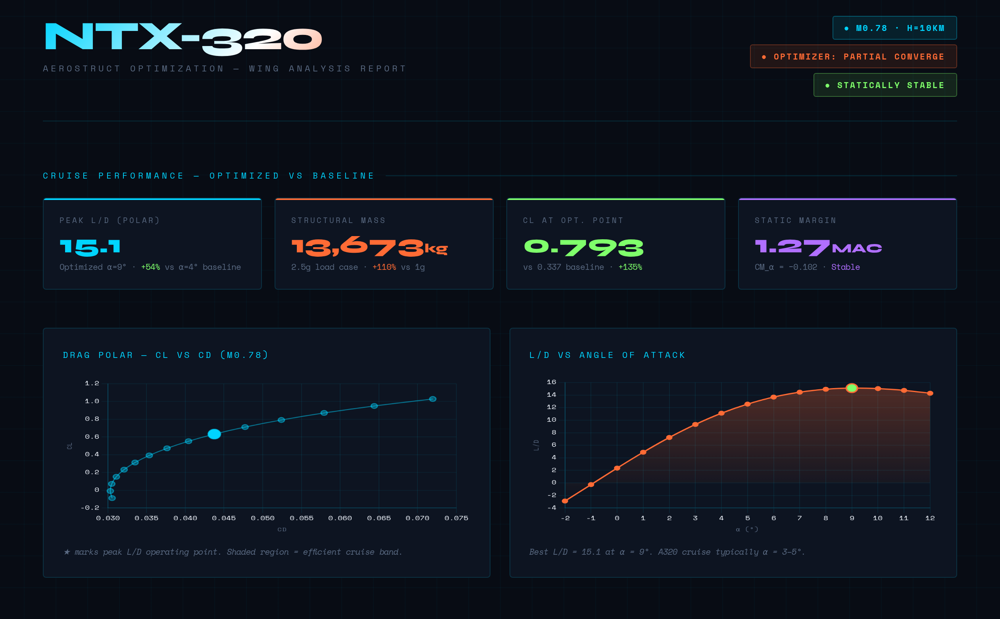
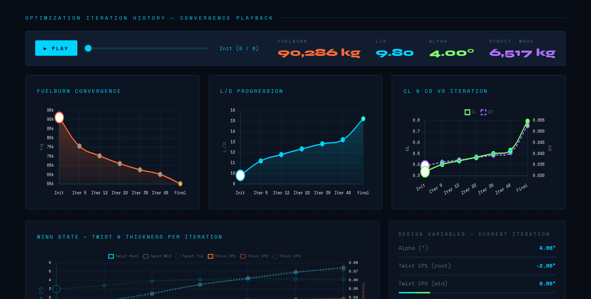

# OpenAeroStruct MCP Server

An [MCP](https://modelcontextprotocol.io) server that wraps [OpenAeroStruct](https://mdolab-openaerostruct.readthedocs-hosted.com) so AI agents can perform aerodynamic and aerostructural wing analysis through simple tool calls — no OpenMDAO boilerplate required.

## Contents

- [Overview](#overview)
- [Quick start (Docker)](#quick-start-docker)
- [Installation (from source)](#installation-from-source)
- [CLI (`oas-cli`)](#cli-oas-cli)
  - [Installation](#cli-installation)
  - [Gotchas](#cli-gotchas)
  - [Three modes](#three-modes)
  - [Interactive mode](#interactive-mode)
  - [One-shot mode](#one-shot-mode)
  - [Script mode](#script--batch-mode)
- [Running the server](#running-the-server)
  - [stdio (Claude Desktop)](#stdio-transport-default--for-claude-desktop-and-most-mcp-clients)
  - [HTTP transport](#http-transport)
- [Running the tests](#running-the-tests)
- [Artifact storage](#artifact-storage)
- [Response envelope](#response-envelope)
- [Observability & validation](#observability--validation)
- [Visualization](#visualization)
- [How agents learn to use the server](#how-agents-learn-to-use-the-server)
- [Architecture](#architecture)
- [Tools reference](#tools-reference)
- [Example walkthrough](#example-walkthrough)
- [Tips](#tips)

---

## Overview

Setting up an OpenAeroStruct analysis normally requires 50–100 lines of OpenMDAO boilerplate: `IndepVarComp`, `Geometry` groups, `AeroPoint` or `AerostructPoint`, and a dozen `connect()` calls. This server hides all of that behind tool calls.

**Analysis tools:**

| Tool | Purpose |
|------|---------|
| `create_surface` | Define a lifting surface geometry |
| `run_aero_analysis` | Single-point VLM analysis (CL, CD, CM) |
| `run_aerostruct_analysis` | Coupled aero + structural analysis (fuel burn, failure) |
| `compute_drag_polar` | Sweep α and return CL-CD-CM arrays |
| `compute_stability_derivatives` | CL_α, CM_α, static margin |
| `run_optimization` | Optimise twist / thickness / α |
| `reset` | Clear surfaces and cached problems |

**Artifact management tools** (every analysis auto-saves; use these to retrieve past results):

| Tool | Purpose |
|------|---------|
| `list_artifacts` | Browse saved runs with optional filters |
| `get_artifact` | Retrieve full metadata + results by `run_id` |
| `get_artifact_summary` | Metadata only — no results payload |
| `delete_artifact` | Remove a saved artifact permanently |

**Observability & trust tools:**

| Tool | Purpose |
|------|---------|
| `get_run` | Full run manifest: inputs, outputs, validation, cache state, available plots |
| `pin_run` | Prevent a cached OpenMDAO problem from being evicted |
| `unpin_run` | Release a cache pin |
| `get_detailed_results` | Sectional Cl, von Mises stress, mesh coordinates |
| `visualize` | Generate a base64 PNG plot for any completed run |
| `get_last_logs` | Server-side log records for a run (debugging) |
| `configure_session` | Set per-session defaults: detail level, auto-plots, requirements |
| `set_requirements` | Define pass/fail criteria checked against every result |

**Key properties:**

- **Persistent artifacts** — every analysis run is saved to disk and returns a `run_id`. Results survive server restarts and can be retrieved at any time.
- **Stateful sessions** — surfaces are stored by name; call `create_surface` once, then run analyses repeatedly without redefining geometry.
- **Problem caching** — `om.Problem.setup()` is expensive. The server runs it once per unique geometry and reuses the cached problem for parameter sweeps, making repeated calls with different α/Mach values fast.
- **Async** — all OpenMDAO computation runs in `asyncio.to_thread()` so the event loop stays responsive.
- **Multiple transports** — stdio (default, for Claude Desktop) or streamable HTTP (for remote/cloud deployment).

---

## Quick start (Docker)

Docker is the easiest way to deploy the server. No Python environment setup required.

### Start the server

```bash
docker compose up -d
```

This starts the `oas-mcp` service on port 8000 with persistent artifact storage via a named volume (`oas-data`).

```bash
docker compose logs -f    # watch logs
docker compose down       # stop the server
```

### Connect from Claude Code

Add to your Claude Code MCP config:

```json
{
  "mcpServers": {
    "openaerostruct": {
      "command": "npx",
      "args": ["-y", "mcp-remote", "http://localhost:8000/mcp"]
    }
  }
}
```

### Connect from Claude.ai

1. Claude.ai → Settings → Integrations → **Add Integration**
2. Type: **Remote MCP Server**
3. URL: `https://your-server.example.com/mcp`
4. OAuth Client ID: `oas-mcp` / OAuth Client Secret: *(from Keycloak)*

See [keycloak_setup.md](keycloak_setup.md) for the full authentication setup guide.

### Production deployment

For multi-user hosting with Keycloak authentication and a Caddy reverse proxy:

```bash
docker compose -f docker-compose.prod.yml up -d
```

See [keycloak_setup.md](keycloak_setup.md) for the complete production deployment walkthrough, including Keycloak realm configuration, TLS, and user onboarding.

### What the server can do

The server supports a full analysis loop: define geometry, run aerodynamic/aerostructural analyses, optimize design variables, and inspect convergence trends and resulting wing-state changes.





### Verify the server is running

```bash
curl -s http://localhost:8000/mcp \
  -X POST \
  -H "Content-Type: application/json" \
  -H "Accept: application/json, text/event-stream" \
  -d '{"jsonrpc":"2.0","id":1,"method":"initialize","params":{"protocolVersion":"2024-11-05","capabilities":{},"clientInfo":{"name":"test","version":"0.1"}}}'
```

You should receive an SSE response containing `serverInfo: {name: "OpenAeroStruct", ...}`.

### Customise the deployment

Override environment variables in `docker-compose.yml` or with `-e` flags:

```bash
docker run -p 8000:8000 -v oas-data:/data \
  -e OAS_TRANSPORT=http \
  -e OAS_DATA_DIR=/data/artifacts \
  -e KEYCLOAK_ISSUER_URL=https://your-keycloak.example.com/realms/oas \
  oas-mcp
```

---

## Installation (from source)

For local development or running the server without Docker.

### Prerequisites

- Python ≥ 3.11
- A C/Fortran toolchain for numpy/scipy (`gcc`, `gfortran`, `libopenblas-dev` on Linux; Xcode CLI tools on macOS)

### Step 1 — Clone and enter the repository

```bash
git clone https://github.com/mdolab/OpenAeroStruct.git
cd OpenAeroStruct
```

### Step 2 — Create a virtual environment

```bash
python -m venv .venv
source .venv/bin/activate        # Linux / macOS
# .venv\Scripts\activate         # Windows PowerShell
```

Or with `uv`:

```bash
uv venv
source .venv/bin/activate
```

### Step 3 — Install the package

**For Claude Desktop / stdio use (minimum):**

```bash
pip install -e ".[mcp]"
# or: uv pip install -e ".[mcp]"
```

**For HTTP transport + Keycloak auth:**

```bash
pip install -e ".[http]"
# or: uv pip install -e ".[http]"
```

The `[http]` extra adds `uvicorn`, `PyJWT[crypto]`, and `httpx` on top of `mcp[cli]`.

**Everything (including test and docs dependencies):**

```bash
pip install -e ".[all]"
```

### Step 4 — Verify the installation

```bash
oas-mcp --help
```

```
usage: oas-mcp [-h] [--transport {stdio,http}] [--host HOST] [--port PORT]
```

---

## CLI (`oas-cli`)

`oas-cli` is a standalone command-line interface to all 23 OAS tools. It does
**not** require an MCP connection — it imports the tool functions directly and
runs them in-process. This makes it the easiest way to use OpenAeroStruct from
Claude Code, shell scripts, CI pipelines, or any terminal-based agent.

### CLI installation

`oas-cli` is registered as a console script in `pyproject.toml`. It becomes
available on `PATH` after a pip/uv install of the package:

```bash
# Editable install (recommended during development)
pip install -e ".[mcp]"
# or: uv pip install -e ".[mcp]"

# Verify it's available
oas-cli list-tools
```

If `oas-cli: command not found`, the package has not been installed into the
active environment, or the virtualenv is not activated. **The entry point is
only created by pip/uv install** — running `python oas_mcp/cli.py` directly
will not work because the package needs to be importable. Fix with:

```bash
# If you have a venv but forgot to install:
source .venv/bin/activate
pip install -e ".[mcp]"

# If you don't have a venv yet:
uv venv && source .venv/bin/activate && uv pip install -e ".[mcp]"
```

You can also invoke the CLI without the entry point via:

```bash
python -m oas_mcp.cli list-tools
```

### CLI gotchas

**Global flags must come _before_ the subcommand.** `--pretty`, `--workspace`,
and `--output` are parser-level flags, not subcommand flags:

```bash
# Correct:
oas-cli --pretty run-aero-analysis --surfaces '["wing"]' --alpha 5

# Wrong (argparse error):
oas-cli run-aero-analysis --surfaces '["wing"]' --alpha 5 --pretty
```

**One-shot mode rebuilds the OpenMDAO problem on every invocation.** Surface
definitions are persisted to `~/.oas_mcp/state/<workspace>.json`, but the
compiled problem is not. Each call pays ~0.1 s for problem setup. For
parameter sweeps or multi-step studies, use interactive or script mode instead.

**Flag names preserve the case of the Python parameter.** Only underscores are
converted to hyphens; capitalisation is kept. So `Mach_number` becomes
`--Mach-number`, `CD0` becomes `--CD0`, and `CL0` becomes `--CL0`. Use
`oas-cli <subcommand> --help` to see exact flag names.

**`num_y` must be odd.** This is an OpenAeroStruct constraint. Passing an even
value will raise `USER_INPUT_ERROR`.

### Three modes

| Situation | Best mode |
|-----------|-----------|
| Multiple related analyses in one session | **Interactive** — in-memory state, fastest |
| Quick one-off check from the terminal | **One-shot** — one subcommand per tool call |
| Reproducible workflow to hand off / re-run | **Script** — JSON file, single process |

### Interactive mode

Spawn `oas-cli interactive` as a long-lived subprocess. Write one JSON object
per line to stdin, read one JSON response per line from stdout. All state lives
in memory for the process lifetime.

```bash
printf '{"tool":"create_surface","args":{"name":"wing","wing_type":"CRM","num_y":7,"symmetry":true,"with_viscous":true,"CD0":0.015}}\n{"tool":"run_aero_analysis","args":{"surfaces":["wing"],"alpha":5.0,"velocity":248.136,"Mach_number":0.84,"density":0.38}}\n' \
  | oas-cli interactive
```

From Python (e.g. inside a coding agent):

```python
import subprocess, json

proc = subprocess.Popen(
    ["oas-cli", "interactive"],
    stdin=subprocess.PIPE, stdout=subprocess.PIPE,
    text=True, bufsize=1,
)

def call(tool, **args):
    proc.stdin.write(json.dumps({"tool": tool, "args": args}) + "\n")
    proc.stdin.flush()
    return json.loads(proc.stdout.readline())

call("create_surface", name="wing", wing_type="CRM", num_y=7)
result = call("run_aero_analysis", surfaces=["wing"], alpha=5.0,
              velocity=248.136, Mach_number=0.84, density=0.38)
print(result["result"]["results"]["CL"])

proc.stdin.close()
proc.wait()
```

### One-shot mode

Each invocation is a standalone process. Surface definitions are automatically
persisted to `~/.oas_mcp/state/<workspace>.json` so multi-step workflows work
across separate calls.

```bash
oas-cli create-surface --name wing --wing-type CRM --num-y 7 \
        --symmetry --with-viscous --CD0 0.015

oas-cli run-aero-analysis --surfaces '["wing"]' --alpha 5.0 \
        --velocity 248.136 --Mach-number 0.84 --density 0.38

# Use --workspace to isolate parallel workflows
oas-cli create-surface --name wing --num-y 7 --workspace study-b
oas-cli --pretty run-aero-analysis --surfaces '["wing"]' --alpha 3 --workspace study-b

# Clear state
oas-cli reset
```

Tool names use hyphens on the CLI: `run_aero_analysis` becomes `run-aero-analysis`.
List/dict parameters are passed as JSON strings: `--surfaces '["wing"]'`.
Bool parameters use `--flag` / `--no-flag`: `--with-viscous` / `--no-with-viscous`.

### Script / batch mode

Write a JSON array of tool calls, execute in one process with shared in-memory
state:

```bash
oas-cli run-script workflow.json
oas-cli --pretty --output results.json run-script workflow.json
```

```json
[
  {"tool": "create_surface", "args": {"name": "wing", "wing_type": "CRM",
                                       "num_y": 7, "symmetry": true}},
  {"tool": "run_aero_analysis", "args": {"surfaces": ["wing"], "alpha": 5.0}}
]
```

---

## Running the server

### stdio transport (default — for Claude Desktop and most MCP clients)

```bash
oas-mcp
# or equivalently:
python -m oas_mcp.server
```

The server speaks the MCP stdio protocol on stdin/stdout. Claude Desktop and most MCP clients use this mode.

#### Add to Claude Desktop

Edit `~/Library/Application Support/Claude/claude_desktop_config.json` (macOS) or the equivalent on your platform:

```json
{
  "mcpServers": {
    "openaerostruct": {
      "command": "/path/to/.venv/bin/python",
      "args": ["-m", "oas_mcp.server"]
    }
  }
}
```

Replace `/path/to/.venv` with the absolute path to the virtual environment where you installed the package.

Restart Claude Desktop after saving the config file. The server should appear in the MCP panel.

#### Smoke-test the server interactively

```bash
mcp dev oas_mcp/server.py
```

This opens the MCP Inspector in your browser. You can call tools directly from the UI to verify everything is working before connecting to Claude Desktop.

---

### HTTP transport

HTTP transport exposes the server as a streamable HTTP endpoint — useful for remote deployment, Docker, or multi-user environments.

#### Step 1 — Install HTTP dependencies

```bash
pip install -e ".[http]"
```

#### Step 2 — Start the server

```bash
oas-mcp --transport http --host 127.0.0.1 --port 8000
```

Or via environment variables (useful in Docker / CI):

```bash
OAS_TRANSPORT=http OAS_PORT=8000 oas-mcp
```

The server will print:
```
INFO:     Started server process [...]
INFO:     Uvicorn running on http://127.0.0.1:8000
```

#### Step 3 — Connect an MCP client

Point your MCP client at `http://127.0.0.1:8000/mcp`.

#### Step 4 — (Optional) Local development tunneling

> **Local development tunneling:** If you're running the server locally and need a public HTTPS URL (e.g., for claude.ai), you can use a tunnel like [ngrok](https://ngrok.com) (`ngrok http 8000`) or Cloudflare Tunnel. Set `RESOURCE_SERVER_URL` in `.env` to the tunnel URL and restart the server. For production use, deploy with Docker and a reverse proxy (see [Quick start](#quick-start-docker)).

#### Step 5 — (Optional) Enable Keycloak authentication

Copy `env.example` to `.env` and fill in your Keycloak details:

```bash
cp env.example .env
```

```dotenv
OAS_TRANSPORT=http
OAS_DATA_DIR=/data/artifacts
KEYCLOAK_ISSUER_URL=https://your-keycloak.railway.app/realms/oas
KEYCLOAK_CLIENT_ID=oas-mcp
KEYCLOAK_CLIENT_SECRET=<your-secret>
RESOURCE_SERVER_URL=http://localhost:8000
```

Then start the server — it will automatically pick up the env vars and wire in the Keycloak token verifier:

```bash
source .env && oas-mcp --transport http
```

When `KEYCLOAK_ISSUER_URL` is set the server validates RS256 JWTs on every request. Requests without a valid Bearer token receive `401 Unauthorized`.

See [keycloak_setup.md](keycloak_setup.md) for the full Keycloak setup guide, including Claude Desktop auth options.

---

## Running the tests

Tests use pytest with `asyncio_mode = "auto"` (configured in `pyproject.toml`).

### Step 1 — Install test dependencies

```bash
pip install pytest pytest-asyncio
# or (if you used the [all] extra, these are already installed)
```

### Step 2 — Run all tests

```bash
pytest
# ~209 tests in ~5 s
```

### Fast feedback — unit tests only (no OAS computation)

```bash
pytest -m "not slow"
# ~100 tests in ~0.3 s
```

This covers:
- `test_artifacts.py` — 20 tests for `ArtifactStore` (no OAS required)
- `test_validators.py` — input validation
- `test_session.py` — session caching
- `test_mesh.py` — mesh building and transforms
- `test_envelope.py` — response envelope and error taxonomy
- `test_validation.py` — physics/numerics validation and requirement checking
- `test_telemetry.py` — structured logging and redaction

### Integration tests only

```bash
pytest -m slow
# ~40 tests in ~5 s (runs real OAS computations)
```

### Golden regression tests

Physics invariant tests assert fundamental aerodynamic and structural properties that must hold on any platform:

```bash
pytest oas_mcp/tests/golden/test_golden_physics.py -v
# 13 physics invariant tests (CD > 0, CL monotone with α, etc.)
```

Numeric baseline tests compare against stored reference values:

```bash
pytest oas_mcp/tests/golden/test_golden_numerics.py -v
# 7 numeric baseline tests (requires golden_values.json)
```

To regenerate the baseline values after an OAS or dependency update:

```bash
python oas_mcp/tests/golden/generate_golden.py
# Prints a diff summary before overwriting — requires human review
```

For deterministic numerics (recommended in CI):

```bash
OMP_NUM_THREADS=1 OPENBLAS_NUM_THREADS=1 MKL_NUM_THREADS=1 pytest
```

### Run a single test file

```bash
pytest oas_mcp/tests/test_artifacts.py -v
pytest oas_mcp/tests/test_tools.py -v
pytest oas_mcp/tests/test_envelope.py -v
```

---

## Artifact storage

Every analysis tool automatically saves its results to disk and returns a `run_id` in its response. You can retrieve, list, or delete artifacts at any time — results persist across server restarts.

### Storage layout

```
$OAS_DATA_DIR/                        # default: ./oas_data/artifacts/
  {session_id}/
    index.json                        # fast index: [{run_id, analysis_type, timestamp, …}]
    20260301T143022_a7f3.json         # full artifact: {metadata: {…}, results: {…}}
    20260301T143055_b2c1.json
```

Set `OAS_DATA_DIR` to control the storage root (default: `./oas_data/artifacts/`; in Docker: `/data/artifacts`).

### Run ID format

Run IDs are formatted as `YYYYMMDDTHHMMSS_{4hex}` — human-readable, chronologically sortable, and collision-resistant (e.g. `20260301T143022_a7f3`).

### Step-by-step: save and retrieve results

**Step 1 — Run an analysis (artifact is saved automatically):**

```python
envelope = await run_aero_analysis(surfaces=["wing"], alpha=5.0)
run_id = envelope["run_id"]         # e.g. "20260301T143022_a7f3"
result = envelope["results"]        # CL, CD, etc.
```

**Step 2 — List saved artifacts:**

```python
# All artifacts across all sessions
list_artifacts()

# Filter by session
list_artifacts(session_id="default")

# Filter by analysis type
list_artifacts(session_id="default", analysis_type="aero")
```

Returns `{count, artifacts: [{run_id, session_id, analysis_type, timestamp, surfaces, tool_name}]}`.

**Step 3 — Retrieve a past result:**

```python
# Full artifact (metadata + results)
get_artifact(run_id="20260301T143022_a7f3")

# Metadata only (lightweight — no results payload)
get_artifact_summary(run_id="20260301T143022_a7f3")
```

**Step 4 — Access via resource URI:**

Any artifact can also be read directly as a resource:

```
oas://artifacts/20260301T143022_a7f3
```

**Step 5 — Delete an artifact:**

```python
delete_artifact(run_id="20260301T143022_a7f3")
```

### Self-healing index

If `index.json` is missing or corrupt (e.g. after a crash or manual file deletion), the index is automatically rebuilt by scanning all artifact files in the session directory. No data is lost.

---

## Response envelope

Every analysis tool returns a **versioned response envelope** rather than a bare results dict. This gives agents a stable contract to program against and surfaces validation and telemetry alongside every result.

```json
{
  "schema_version": "1.0",
  "tool_name": "run_aero_analysis",
  "run_id": "20260302T143022_a7f3",
  "timestamp": "2026-03-02T14:30:22+00:00",
  "inputs_hash": "sha256-a3f7c1...",
  "results": { "CL": 0.546, "CD": 0.037, "L_over_D": 14.9, "surfaces": { ... } },
  "validation": { "passed": true, "error_count": 0, "warning_count": 0, "findings": [] },
  "telemetry": { "elapsed_s": 0.127, "oas.cache.hit": true, "oas.surface.count": 1 }
}
```

Results are at `envelope["results"]`, not at the top level. The `run_id` in the envelope is the handle for all follow-up calls: `get_run`, `pin_run`, `get_detailed_results`, `visualize`, `get_last_logs`.

For full details, see **[observability.md — Response envelope](observability.md#response-envelope)**.

---

## Observability & validation

Every analysis response includes a `validation` block with automatically-run physics and numerics checks:

- **CD > 0** — drag is always positive
- **failure < 1.0** — structural utilisation below yield (failure > 1.0 = failure, not > 0)
- **CL sign** — consistent with angle of attack direction
- **L_equals_W residual** — lift ≈ weight trim for aerostructural runs
- **Optimizer convergence** — `success == True` for optimization runs

You can also define your own **custom requirements** that are checked against every result:

```python
set_requirements([
    {"path": "CL",                    "operator": ">=", "value": 0.4,  "label": "min_CL"},
    {"path": "surfaces.wing.failure", "operator": "<",  "value": 1.0,  "label": "no_failure"},
])
```

Other observability tools:

- **`get_run(run_id)`** — full manifest (inputs, outputs, validation, cache state, available plots)
- **`pin_run` / `unpin_run`** — prevent cache eviction during multi-step workflows
- **`get_last_logs(run_id)`** — server-side log records for debugging
- **`configure_session`** — set per-session defaults for detail level, validation threshold, auto-plots

For the complete guide with all check IDs, severity levels, and a worked multi-step example, see **[observability.md](observability.md)**.

---

## Visualization

The `visualize` tool generates plots from any completed run and returns a 900×540 px base64 PNG:

```python
plot = visualize(run_id=run_id, plot_type="lift_distribution", case_name="CRM cruise")
# plot["image_base64"] — standard base64-encoded PNG
# plot["image_hash"]   — sha256 prefix for client-side caching
```

**Available plot types:**

| Plot type | Description | Requires |
|-----------|-------------|---------|
| `lift_distribution` | Spanwise Cl bar chart | Any single-point run |
| `drag_polar` | CL-CD parabola + L/D vs α | `compute_drag_polar` run |
| `stress_distribution` | Von Mises stress + failure index | `run_aerostruct_analysis` run |
| `convergence` | Solver residual history | Run with convergence captured |
| `planform` | Top-down wing planform view | Any run (mesh snapshot persisted) |

Call `get_run(run_id)["available_plots"]` to see which types are available for a given run before calling `visualize`.

Auto-generate plots after every analysis:

```python
configure_session(auto_visualize=["lift_distribution"])
# envelope["auto_plots"]["lift_distribution"] is now present in every analysis response
```

For the complete guide with all plot types, response format, and progressive zoom workflow, see **[visualization.md](visualization.md)**.

---

## How agents learn to use the server

MCP provides three built-in mechanisms for conveying knowledge to an LLM or agent. The server uses all three layers:

### Layer 1 — Server instructions (automatic, always-on)

The `instructions` field on the `FastMCP` instance is sent to the LLM when the server connects. It covers:

- The mandatory workflow order (`create_surface` → analysis → optimisation)
- Hard constraints that cause errors if violated (odd `num_y`, structural properties required for aerostruct)
- Sensible default parameter values for cruise flight conditions
- Artifact storage: how to retrieve past results using `run_id`
- A note about performance (problem caching)

This is the first thing an agent sees — it sets the framing without requiring any user action.

### Layer 2 — Prompts (invokable workflows)

MCP prompts are named templates that encode "how to accomplish goal X" rather than "what does tool Y do". They accept arguments and return a user message that seeds the conversation with a fully specified plan. The server exposes three:

| Prompt | Arguments | What it produces |
|--------|-----------|-----------------|
| `analyze_wing` | `wing_type`, `target_CL`, `Mach`, `span` | Step-by-step plan: create → single-point → drag polar → stability check |
| `aerostructural_design` | `W0_kg`, `load_factor`, `material` | Plan including material properties, structural interpretation guide, fallback to optimisation if structure fails |
| `optimize_wing` | `objective`, `target_CL`, `analysis_type` | Plan with correctly formatted DV/constraint dicts for the chosen objective and analysis type |

In **Claude Desktop**, prompts appear in the `+` attachment menu and can be invoked by the user as conversation starters. In **agentic pipelines**, the orchestrator calls `prompts/get` to retrieve the message and prepends it to the agent's context.

### Layer 3 — Resources (on-demand reference material)

Resources are URI-addressable documents the LLM can read when it needs detail.

| URI | Content |
|-----|---------|
| `oas://reference` | Parameter tables for all tools, valid value lists, return-value schemas, artifact storage guide, common errors and fixes |
| `oas://workflows` | Five complete step-by-step workflows (aero analysis, aerostructural sizing, aero optimisation, aerostructural optimisation, multi-surface wing+tail) |
| `oas://artifacts/{run_id}` | Full JSON artifact for any saved run |

---

## Architecture

```
oas_mcp/
├── server.py          # FastMCP entry point — all @mcp.tool() registrations
├── core/
│   ├── artifacts.py   # ArtifactStore — filesystem-backed, thread-safe result persistence
│   ├── auth.py        # KeycloakTokenVerifier — RS256 JWT validation for HTTP transport
│   ├── builders.py    # build_aero_problem() / build_aerostruct_problem() / build_optimization_problem()
│   ├── connections.py # connect_aero_surface() / connect_aerostruct_surface()
│   ├── convergence.py # ConvergenceMonitor, extract_convergence() — solver residual capture
│   ├── defaults.py    # Default flight conditions and surface properties
│   ├── envelope.py    # make_envelope() / make_error_envelope() — versioned response wrapper
│   ├── errors.py      # UserInputError, SolverConvergenceError, CacheEvictedError, InternalError
│   ├── mesh.py        # generate_mesh() wrapper + sweep/dihedral/taper transforms
│   ├── plotting.py    # generate_plot() — 5 plot types, 900×540 px base64 PNG
│   ├── requirements.py # check_requirements() — dot-path assertion engine
│   ├── results.py     # extract_aero_results() / extract_aerostruct_results() / extract_standard_detail()
│   ├── session.py     # Session / SessionManager — surface store, problem cache, pinning, defaults
│   ├── telemetry.py   # span(), get_run_logs(), redact(), make_telemetry() — structured logging
│   ├── validation.py  # validate_aero/aerostruct/drag_polar/stability/optimization()
│   └── validators.py  # Input validation with descriptive error messages
└── tests/
    ├── conftest.py               # Fixtures: isolate_artifacts, clean_session, aero_wing, struct_wing
    ├── test_artifacts.py         # Unit tests for ArtifactStore (no OAS required)
    ├── test_envelope.py          # Unit tests for envelope + error taxonomy
    ├── test_mesh.py              # Unit tests for mesh building and transforms
    ├── test_session.py           # Unit tests for session caching + pinning
    ├── test_telemetry.py         # Unit tests for logging and redaction
    ├── test_tools.py             # Integration tests for all tools
    ├── test_validation.py        # Unit tests for physics checks + requirements
    ├── test_validators.py        # Unit tests for input validators
    └── golden/
        ├── test_golden_physics.py  # 13 platform-independent physics invariant tests
        ├── test_golden_numerics.py # 7 numeric baseline tests vs golden_values.json
        ├── golden_values.json      # Stored baseline values with reproducibility header
        └── generate_golden.py      # Regenerates baselines with diff summary
```

### How a tool call flows

```
MCP client
  └─ tool call (e.g. run_aero_analysis)
       └─ server.py: validates inputs, checks session
            └─ asyncio.to_thread(_run)          ← leaves event loop free
                 └─ session.get_cached_problem()
                      ├─ HIT  → set new flight conditions, run_model()
                      └─ MISS → builders.build_aero_problem()
                                   ├─ mesh.py: Geometry group + connections
                                   ├─ builders.py: AeroPoint + IndepVarComp
                                   ├─ prob.setup()   ← expensive, done once
                                   └─ session.store_problem()
                 └─ results.extract_aero_results() → (results, standard_detail)
                      └─ results.extract_standard_detail() → sectional Cl, mesh snapshot
            └─ _artifacts.save(results + standard_detail)  ← thread-safe file I/O
            └─ validation.validate_aero(results) → findings
            └─ check_requirements(session.requirements, results)
            └─ make_telemetry(elapsed, cache_hit, ...)
            └─ make_envelope(tool_name, run_id, inputs, results, validation, telemetry)
```

### Session caching

Each `Session` object holds:

- **`surfaces`** — a `dict[name → surface dict]` populated by `create_surface`.
- **`_cache`** — a `dict[key → _CachedProblem]` where the key encodes the set of surface names and analysis type (`"aero:wing"`, `"aerostruct:wing"`).

Cache invalidation is fingerprint-based. When `create_surface` is called for a surface that already exists, the stored surface dict is replaced and any cached problem referencing that surface is evicted. The fingerprint is a SHA-256 hash of the surface dict contents (numpy arrays are serialised to lists).

### OpenMDAO model structure

**Aero-only** (`build_aero_problem`):

```
prob.model
├── prob_vars (IndepVarComp)  v, alpha, Mach_number, re, rho, cg
├── {name} (Geometry)         for each surface
└── aero (AeroPoint)
      ├── {name}              def_mesh
      ├── aero_states         vortex lattice solve
      └── {name}_perf         CL, CD, CDi, CDv, CDw
```

**Aerostructural** (`build_aerostruct_problem`):

```
prob.model
├── prob_vars (IndepVarComp)  + CT, R, W0, speed_of_sound, load_factor, empty_cg
├── {name} (AerostructGeometry)  mesh, nodes, stiffness, structural_mass
└── AS_point_0 (AerostructPoint)
      ├── coupled             aero-structural iteration
      ├── {name}_perf         CL, CD, failure, vonmises
      └── total_perf          fuelburn, L_equals_W, CG
```

---

## Tools reference

### `create_surface`

Defines a lifting surface and stores it in the session. Must be called before any analysis tool.

| Parameter | Type | Default | Description |
|-----------|------|---------|-------------|
| `name` | str | `"wing"` | Unique surface identifier |
| `wing_type` | str | `"rect"` | `"rect"` for rectangular or `"CRM"` for Common Research Model |
| `span` | float | `10.0` | Full wingspan in metres |
| `root_chord` | float | `1.0` | Root chord in metres |
| `taper` | float | `1.0` | Taper ratio (tip/root chord) |
| `sweep` | float | `0.0` | Leading-edge sweep in degrees |
| `dihedral` | float | `0.0` | Dihedral angle in degrees |
| `num_x` | int | `2` | Chordwise mesh nodes (≥ 2) |
| `num_y` | int | `7` | Spanwise mesh nodes (must be **odd**, ≥ 3) |
| `symmetry` | bool | `True` | Model half-span (recommended) |
| `twist_cp` | float[] | `None` | Twist control-point values in degrees **(root-to-tip: cp[0]=root, cp[-1]=tip)** |
| `t_over_c_cp` | float[] | `[0.15]` | Thickness-to-chord ratio control points **(root-to-tip)** |
| `CL0` | float | `0.0` | Profile CL at α=0 |
| `CD0` | float | `0.015` | Zero-lift profile drag |
| `with_viscous` | bool | `True` | Include viscous drag |
| `with_wave` | bool | `False` | Include wave drag |
| `fem_model_type` | str | `None` | `"tube"`, `"wingbox"`, or `None` for aero-only |
| `thickness_cp` | float[] | `None` | Tube wall thickness control points in metres **(root-to-tip)** |
| `E` | float | `70e9` | Young's modulus in Pa |
| `G` | float | `30e9` | Shear modulus in Pa |
| `yield_stress` | float | `500e6` | Yield stress in Pa |
| `safety_factor` | float | `2.5` | Safety factor on yield stress |
| `mrho` | float | `3000.0` | Material density in kg/m³ |
| `offset` | float[3] | `None` | [x, y, z] origin offset in metres |

**Returns:** `{surface_name, mesh_shape, span_m, mean_chord_m, estimated_area_m2, twist_cp_shape, has_structure, status}`

> **Note on `num_y`:** OpenAeroStruct requires an odd number of spanwise nodes. If you pass an even value the tool raises a `ValueError` and suggests the nearest valid options.

> **Note on `*_cp` ordering:** All control-point arrays (`twist_cp`, `chord_cp`, `t_over_c_cp`, `thickness_cp`, `spar_thickness_cp`, `skin_thickness_cp`) use **root-to-tip** ordering: `cp[0]` = root value, `cp[-1]` = tip value. Example: `twist_cp=[-7, 0]` means root=−7° (washed in), tip=0°. Optimised DV arrays returned by `run_optimization` follow the same convention.

---

### `run_aero_analysis`

Single-point vortex-lattice (VLM) aerodynamic analysis.

| Parameter | Type | Default | Description |
|-----------|------|---------|-------------|
| `surfaces` | str[] | — | Surface names to include |
| `velocity` | float | `248.136` | Free-stream velocity in m/s |
| `alpha` | float | `5.0` | Angle of attack in degrees |
| `Mach_number` | float | `0.84` | Mach number |
| `reynolds_number` | float | `1e6` | Reynolds number per metre |
| `density` | float | `0.38` | Air density in kg/m³ |
| `cg` | float[3] | `[0,0,0]` | Centre of gravity in metres |
| `session_id` | str | `"default"` | Session identifier |

**Returns:** `{CL, CD, CM, L_over_D, surfaces: {name: {CL, CD, CDi, CDv, CDw}}, run_id}`

The `run_id` can be passed to `get_artifact` at any future time to retrieve this result.

---

### `run_aerostruct_analysis`

Coupled VLM + beam FEM analysis. Surfaces must have `fem_model_type` set.

Additional parameters beyond `run_aero_analysis`:

| Parameter | Type | Default | Description |
|-----------|------|---------|-------------|
| `W0` | float | `120000` | Empty weight (excl. wing structure) in kg |
| `CT` | float | auto | Specific fuel consumption in 1/s |
| `R` | float | `11.165e6` | Mission range in metres |
| `speed_of_sound` | float | `295.4` | Speed of sound in m/s |
| `load_factor` | float | `1.0` | Load factor |
| `empty_cg` | float[3] | `[0,0,0]` | Empty CG location in metres |

**Returns:** aero results + `{fuelburn, structural_mass, L_equals_W, surfaces: {name: {..., failure, max_vonmises_Pa, structural_mass_kg}}, run_id}`

The `failure` metric uses a KS-aggregated stress constraint (negative = no failure, positive = failed).

---

### `compute_drag_polar`

Sweeps angle of attack and returns CL, CD, CM arrays.

| Parameter | Type | Default | Description |
|-----------|------|---------|-------------|
| `surfaces` | str[] | — | Surface names |
| `alpha_start` | float | `-5.0` | Start angle in degrees |
| `alpha_end` | float | `15.0` | End angle in degrees |
| `num_alpha` | int | `21` | Number of alpha points |
| + flight conditions | | | Same as `run_aero_analysis` (no `alpha`) |

**Returns:** `{alpha_deg[], CL[], CD[], CM[], L_over_D[], best_L_over_D: {alpha_deg, CL, CD, L_over_D}, run_id}`

---

### `compute_stability_derivatives`

Computes CL_α, CM_α, and static margin using finite differencing between two `AeroPoint` instances (Δα = 1×10⁻⁴ deg).

**Returns:** `{CL, CD, CM, CL_alpha [1/deg], CM_alpha [1/deg], static_margin, stability, run_id}`

`static_margin = −CM_α / CL_α`. Positive means statically stable.

---

### `run_optimization`

Minimises an objective subject to constraints using SciPy's SLSQP.

| Parameter | Type | Default | Description |
|-----------|------|---------|-------------|
| `surfaces` | str[] | — | Surface names |
| `analysis_type` | str | `"aero"` | `"aero"` or `"aerostruct"` |
| `objective` | str | `"CD"` | See table below |
| `design_variables` | dict[] | `[{name:alpha}]` | See table below |
| `constraints` | dict[] | `[{name:CL, equals:0.5}]` | See table below |
| `tolerance` | float | `1e-6` | Convergence tolerance |
| `max_iterations` | int | `200` | Maximum iterations |

**Objective names:**

| Analysis type | Options |
|---------------|---------|
| `aero` | `CD`, `CL` |
| `aerostruct` | `fuelburn`, `structural_mass`, `CD` |

**Design variable names:** `twist`, `thickness`, `chord`, `sweep`, `taper`, `alpha`, `spar_thickness`, `skin_thickness`

Each DV dict: `{"name": "twist", "lower": -10.0, "upper": 15.0}` (scaler optional)

**Constraint names:**

| Analysis type | Options |
|---------------|---------|
| `aero` | `CL`, `CD`, `CM` |
| `aerostruct` | all aero + `failure`, `thickness_intersects`, `L_equals_W` |

Each constraint dict: `{"name": "CL", "equals": 0.5}` or `{"name": "failure", "upper": 0.0}`

**Returns:** `{success, optimized_design_variables, final_results, run_id}`

---

### `reset`

Clears surfaces and cached problems.

```
reset()                       # clears all sessions
reset(session_id="default")   # clears one session
```

---

### `list_artifacts`

Browse saved analysis runs.

| Parameter | Type | Default | Description |
|-----------|------|---------|-------------|
| `session_id` | str | `None` | Filter by session, or `None` for all sessions |
| `analysis_type` | str | `None` | Filter by type: `"aero"`, `"aerostruct"`, `"drag_polar"`, `"stability"`, `"optimization"` |

**Returns:** `{count, artifacts: [{run_id, session_id, analysis_type, timestamp, surfaces, tool_name}]}`

---

### `get_artifact`

Retrieve a saved artifact by `run_id`.

| Parameter | Type | Default | Description |
|-----------|------|---------|-------------|
| `run_id` | str | — | Run ID returned by an analysis tool |
| `session_id` | str | `None` | Optional hint — speeds up lookup when provided |

**Returns:** `{metadata: {run_id, session_id, analysis_type, timestamp, surfaces, tool_name, parameters}, results: {…}}`

Raises `ValueError` if the run ID is not found.

---

### `get_artifact_summary`

Retrieve artifact metadata only — no results payload. Much smaller response than `get_artifact`.

Same parameters as `get_artifact`.

**Returns:** `{run_id, session_id, analysis_type, timestamp, surfaces, tool_name, parameters}`

---

### `delete_artifact`

Permanently remove a saved artifact from disk and its index entry.

| Parameter | Type | Default | Description |
|-----------|------|---------|-------------|
| `run_id` | str | — | Run ID to delete |
| `session_id` | str | `None` | Optional hint |

**Returns:** `{status: "deleted", run_id}`

Raises `ValueError` if the run ID is not found.

---

### `get_run`

Return a full manifest for a completed run: inputs, outputs, validation, cache state, and available plot types.

| Parameter | Type | Default | Description |
|-----------|------|---------|-------------|
| `run_id` | str | — | Run ID to inspect |
| `session_id` | str | `None` | Optional hint for faster lookup |

**Returns:** `{run_id, tool_name, analysis_type, timestamp, surfaces, inputs, outputs_summary, cache_state, detail_levels_available, available_plots}`

Use `available_plots` to know which `visualize()` calls will succeed. See [observability.md](observability.md#run-manifest-get_run) for a full example.

---

### `pin_run`

Pin a cached OpenMDAO problem to prevent eviction during multi-step workflows.

| Parameter | Type | Default | Description |
|-----------|------|---------|-------------|
| `run_id` | str | — | Run ID to pin |
| `surfaces` | str[] | — | Surface names used in the run |
| `analysis_type` | str | `"aero"` | `"aero"` or `"aerostruct"` |
| `session_id` | str | `"default"` | Session identifier |

**Returns:** `{run_id, pinned, message}`

Call `unpin_run(run_id)` when finished to release memory.

---

### `unpin_run`

Release a cache pin, allowing the OpenMDAO problem to be evicted.

| Parameter | Type | Default | Description |
|-----------|------|---------|-------------|
| `run_id` | str | — | Run ID to unpin |
| `session_id` | str | `"default"` | Session identifier |

**Returns:** `{run_id, released, message}`

---

### `get_detailed_results`

Retrieve richer data than the top-level scalars in the analysis response.

| Parameter | Type | Default | Description |
|-----------|------|---------|-------------|
| `run_id` | str | — | Run ID to retrieve details for |
| `detail_level` | str | `"standard"` | `"summary"` or `"standard"` |
| `session_id` | str | `None` | Optional hint |

**Returns:**

- `"summary"` — `{run_id, detail_level, results: {top-level scalars}}`
- `"standard"` — `{run_id, detail_level, sectional_data: {surf: {y_span_norm, Cl, vonmises_MPa, failure_index}}, mesh_snapshot: {surf: {leading_edge, trailing_edge, nx, ny}}}`

Standard detail is persisted at run time and survives cache eviction. See [observability.md](observability.md#detailed-results).

---

### `visualize`

Generate a plot and return a base64-encoded PNG.

| Parameter | Type | Default | Description |
|-----------|------|---------|-------------|
| `run_id` | str | — | Run ID to visualise |
| `plot_type` | str | — | One of: `lift_distribution`, `drag_polar`, `stress_distribution`, `convergence`, `planform` |
| `session_id` | str | `None` | Optional hint |
| `case_name` | str | `""` | Human-readable label for the plot title |

**Returns:** `{plot_type, run_id, format, width_px, height_px, image_hash, image_base64}`

All plots are 900×540 px PNG. `image_hash` is the first 8 hex chars of SHA-256(png_bytes) for client-side caching. See [visualization.md](visualization.md) for full guide.

---

### `get_last_logs`

Retrieve server-side log records captured during a run.

| Parameter | Type | Default | Description |
|-----------|------|---------|-------------|
| `run_id` | str | — | Run ID to retrieve logs for |

**Returns:** `{run_id, log_count, logs: [{time, level, message, logger}]}`

Logs are retained for the last 100 runs (configurable via `OAS_LOG_MAX_RUNS`). Useful for debugging `SOLVER_CONVERGENCE_ERROR` and `INTERNAL_ERROR` responses. See [observability.md](observability.md#server-logs-get_last_logs).

---

### `configure_session`

Set per-session defaults that apply to all subsequent calls in the session.

| Parameter | Type | Default | Description |
|-----------|------|---------|-------------|
| `session_id` | str | `"default"` | Session to configure |
| `default_detail_level` | str | `None` | `"summary"` or `"standard"` |
| `validation_severity_threshold` | str | `None` | `"error"`, `"warning"`, or `"info"` |
| `auto_visualize` | str[] | `None` | Plot types to auto-generate with each analysis |
| `telemetry_mode` | str | `None` | `"off"`, `"logging"`, or `"otel"` |
| `requirements` | dict[] | `None` | Requirements checked against every result |

**Returns:** `{session_id, status, current_defaults, requirements_count}`

See [observability.md](observability.md#session-configuration-configure_session) for full parameter documentation.

---

### `set_requirements`

Define pass/fail criteria that are automatically checked against every analysis result in the session.

| Parameter | Type | Default | Description |
|-----------|------|---------|-------------|
| `requirements` | dict[] | — | List of `{path, operator, value, label}` dicts |
| `session_id` | str | `"default"` | Session identifier |

**Operators:** `==`, `!=`, `<`, `<=`, `>`, `>=`

**Example:**

```python
set_requirements([
    {"path": "CL",                    "operator": ">=", "value": 0.4,  "label": "min_CL"},
    {"path": "surfaces.wing.failure", "operator": "<",  "value": 1.0,  "label": "no_failure"},
])
```

**Returns:** `{session_id, requirements_set, requirements}`

Failed requirements appear as `"error"` severity findings in the `validation` block of every subsequent analysis response. See [observability.md](observability.md#custom-requirements).

---

## Example walkthrough

This example defines a CRM wing, runs a cruise-point analysis, sweeps the drag polar, checks stability, runs an aerostructural analysis, optimises twist for minimum drag, and then retrieves the saved results.

### Step 1 — Define the wing

```python
create_surface(
    name           = "wing",
    wing_type      = "CRM",       # Common Research Model planform
    num_x          = 2,           # chordwise panels
    num_y          = 7,           # spanwise panels (must be odd)
    symmetry       = True,
    with_viscous   = True,
    CD0            = 0.015,       # fuselage + nacelle parasite drag
    fem_model_type = "tube",      # enables structural analysis
    E              = 70e9,        # Al 7075
    G              = 30e9,
    yield_stress   = 500e6,
    safety_factor  = 2.5,
    mrho           = 3000.0,
)
```

### Step 2 — Single-point aero analysis

```python
envelope = run_aero_analysis(
    surfaces        = ["wing"],
    velocity        = 248.136,   # m/s (~Mach 0.84 at cruise altitude)
    alpha           = 5.0,       # deg
    Mach_number     = 0.84,
    reynolds_number = 1e6,
    density         = 0.38,      # kg/m³ (≈ 11 000 m altitude)
)
run_id_aero = envelope["run_id"]   # e.g. "20260301T143022_a7f3"
result = envelope["results"]       # CL, CD, CM, etc.
```

```json
{
  "schema_version": "1.0",
  "tool_name": "run_aero_analysis",
  "run_id": "20260301T143022_a7f3",
  "results": {
    "CL": 0.5459, "CD": 0.0367, "CM": -0.6844, "L_over_D": 14.88,
    "surfaces": {"wing": {"CL": 0.5459, "CDi": 0.0229, "CDv": 0.0123}}
  },
  "validation": { "passed": true, "error_count": 0, "findings": [] },
  "telemetry": { "elapsed_s": 0.12, "oas.cache.hit": false }
}
```

### Step 3 — Drag polar

```python
compute_drag_polar(
    surfaces    = ["wing"],
    alpha_start = 0.0,
    alpha_end   = 12.0,
    num_alpha   = 7,
    Mach_number = 0.84,
    density     = 0.38,
)
```

```
alpha   CL      CD      L/D
  0.0   0.1623  0.0279   5.82
  2.0   0.3161  0.0304  10.40
  4.0   0.4695  0.0342  13.71
  6.0   0.6220  0.0395  15.76
  8.0   0.7736  0.0460  16.82
 10.0   0.9239  0.0538  17.16   ← best L/D
 12.0   1.0727  0.0629  17.05
```

### Step 4 — Stability derivatives

```python
compute_stability_derivatives(
    surfaces    = ["wing"],
    alpha       = 5.0,
    Mach_number = 0.84,
    density     = 0.38,
    cg          = [5.0, 0.0, 0.0],   # CG at 5 m from leading edge
)
```

```json
{
  "CL_alpha": 0.0862, "CM_alpha": -0.0214,
  "static_margin": 0.248,
  "stability": "statically stable (positive static margin)"
}
```

### Step 5 — Coupled aerostructural analysis

```python
struct_envelope = run_aerostruct_analysis(
    surfaces       = ["wing"],
    velocity       = 248.136,
    alpha          = 5.0,
    Mach_number    = 0.84,
    density        = 0.38,
    W0             = 120000,    # kg (aircraft empty weight excl. wing)
    R              = 11.165e6,  # m (range)
    speed_of_sound = 295.4,
    load_factor    = 1.0,
)
struct_result = struct_envelope["results"]
```

```json
{
  "schema_version": "1.0",
  "run_id": "20260301T143055_b2c1",
  "results": {
    "CL": 0.5281, "CD": 0.0364, "L_over_D": 14.50,
    "fuelburn": 165564, "structural_mass": 124259,
    "L_equals_W": 0.496,
    "surfaces": {"wing": {"failure": -0.7676, "structural_mass_kg": 124259}}
  },
  "validation": { "passed": true, "error_count": 0, "findings": [] }
}
```

`failure < 0` means no structural failure at this load condition. Values above 1.0 indicate structural failure.

### Step 6 — Aerodynamic optimisation

Minimise CD subject to CL = 0.5 by varying twist and angle of attack:

```python
run_optimization(
    surfaces         = ["wing"],
    analysis_type    = "aero",
    objective        = "CD",
    design_variables = [
        {"name": "twist", "lower": -10.0, "upper": 15.0},
        {"name": "alpha", "lower":  -5.0, "upper": 15.0},
    ],
    constraints      = [{"name": "CL", "equals": 0.5}],
    Mach_number      = 0.84,
    density          = 0.38,
)
```

```json
{
  "success": true,
  "optimized_design_variables": {
    "alpha": [4.537],
    "twist": [-3.821, -1.786, 0.495, 6.517]
  },
  "final_results": {"CL": 0.5000, "CD": 0.0351, "L_over_D": 14.25},
  "run_id": "20260301T143120_c4d9"
}
```

### Step 7 — Inspect and visualize a past result

```python
run_id = "20260301T143022_a7f3"   # from step 2

# Full run manifest (inputs, outputs, cache state, available plots)
manifest = get_run(run_id)
print(manifest["available_plots"])         # ['lift_distribution', 'planform']

# Get sectional data
details = get_detailed_results(run_id, detail_level="standard")
cl_dist = details["sectional_data"]["wing"]["Cl"]

# Generate a lift distribution plot
plot = visualize(run_id=run_id, plot_type="lift_distribution", case_name="CRM cruise α=5°")
# plot["image_base64"] — 900×540 px PNG

# Server-side debug logs if anything looked unexpected
logs = get_last_logs(run_id)
```

### Step 8 — Retrieve past artifacts

```python
# Look up the aero analysis saved in step 2
get_artifact(run_id="20260301T143022_a7f3")

# Or browse all saved runs for this session
list_artifacts(session_id="default")

# Or check just the metadata (no results payload)
get_artifact_summary(run_id="20260301T143022_a7f3")
```

---

## Tips

**Parameter sweeps are fast.** After the first `run_aero_analysis` call, the OpenMDAO problem is cached. Subsequent calls with different `alpha` or `Mach_number` values skip `setup()` entirely — useful when an agent is iterating to find an operating point.

**Multi-surface configurations.** Pass multiple surface names to analysis tools to model wing + tail configurations. Each surface must be created separately with `create_surface`.

**Sessions.** All tools accept an optional `session_id` parameter (default `"default"`). Use different session IDs to maintain multiple independent configurations in the same server process. Artifacts are stored per session and can be filtered by `session_id` when listed.

**Structural sizing.** The default `thickness_cp` is `0.1 * root_chord` at every control point. For realistic structural analysis, provide explicit values or let the solver size the structure with a `failure` constraint via `run_optimization`.

**Artifact `session_id` hint.** If you know which session produced a `run_id`, passing `session_id` to `get_artifact`, `get_artifact_summary`, and `delete_artifact` makes the lookup O(1) instead of scanning all session directories.

**Always check `validation.passed`.** Every analysis response includes automatic physics checks. Before acting on results, check `envelope["validation"]["passed"]`. If `False`, review `envelope["validation"]["findings"]` for check ID, message, and remediation hint.

**Failure index threshold is 1.0, not 0.** A `failure` value of 0.9 means the structure is near its limit but has not failed. Values above 1.0 indicate structural failure. This is a KS-aggregated von Mises utilisation ratio.

**Use `pin_run` in multi-step workflows.** If an agent runs an analysis, then does several other tool calls, then wants `get_detailed_results` or `visualize`, pin the run after the analysis to guarantee the cached problem is still in memory. Unpin when done.

**`get_detailed_results` survives cache eviction.** Standard-level detail (sectional Cl, von Mises, mesh coordinates) is persisted to disk at run time. You can call `get_detailed_results(run_id, "standard")` at any time without needing the live problem in memory.

**Set project requirements once with `configure_session`.** Rather than manually checking CL ≥ 0.4, failure < 1.0, etc. after every analysis, set these as session requirements. They appear automatically in the validation block of every subsequent response.
